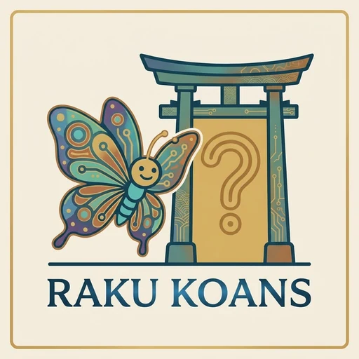

<p align="center">
  
</p>

<h1 align="center">Raku Koans</h1>

<p align="center">
  Learn Raku from syntax to culture through 105 browser-based koans.
</p>

<p align="center">
  <strong>▶ <a href="https://hankache.github.io/raku-koans/">Start the path at hankache.github.io/raku-koans</a></strong>
</p>

<p align="center">
  <a href="https://github.com/hankache/raku-koans/actions/workflows/deploy.yml"></a>
  <a href="https://github.com/ash/rakupp/releases"></a>
  <a href="LICENSE"></a>
  <a href="LICENSE-ARTWORK"></a>
</p>

Each koan is a small Raku program whose tests fail. Replace every `___` until they pass, and Raku
tells you whether you've got it right or shows you what is expected. 

It's test-driven from the
start. The koans are written with Raku's `Test` module, so you learn the language and how to
test it at the same time. 

Raku Koans are inspired by [Ruby Koans](https://www.rubykoans.com/).

Everything runs in your browser on Raku.js, the [Raku++](https://github.com/ash/rakupp) interpreter compiled to WebAssembly. There's nothing to install and no need for accounts and log-ins. Progress is saved locally in the browser.

## The path

The koans follow [raku.guide](https://raku.guide), extended with topics from the
[Raku documentation](https://docs.raku.org) that the guide leaves out, such as pairs, sets,
supplies, parametric roles and grammars.

| #  | Group                               | Koans | Covers                                                        |
|----|-------------------------------------|-------|---------------------------------------------------------------|
| 1  | Awakening                           | 6     | the `Test` module, syntax, truth                              |
| 2  | Numbers                             | 7     | arithmetic, comparison, coercion, exact numbers, bases        |
| 3  | Strings                             | 7     | quoting, heredocs, formatting, methods, smartmatch            |
| 4  | Variables                           | 6     | sigils, types, introspection, scope, binding, dynamic variables |
| 5  | Lists and hashes                    | 8     | arrays, ranges, hashes, pairs, sorting, reduction             |
| 6  | Sets, subsets and enums             | 3     | set operators, subset types, enums                            |
| 7  | Control flow                        | 7     | `if` to `loop`, loop control and phasers                      |
| 8  | Subroutines                         | 8     | signatures, multiple dispatch, your own operators             |
| 9  | Functional programming              | 8     | chaining, feeds, hyper and meta-operators, closures           |
| 10 | Junctions, laziness and concurrency | 7     | lazy lists, `gather`, parallelism, supplies, channels         |
| 11 | Objects                             | 7     | classes, encapsulation, constructors, methods                 |
| 12 | Inheritance and roles               | 7     | parents, roles, parametric roles, mixins, introspection      |
| 13 | Exceptions                          | 3     | catching, throwing, your own exceptions                       |
| 14 | Regular expressions                 | 9     | matching, captures, substitution, named regexes               |
| 15 | Grammars                            | 7     | tokens and rules, the match tree, actions, proto tokens       |
| 16 | Text and the world                  | 5     | Unicode, `say` and `print`, files and directories             |

## Running it locally

You need [Node.js](https://nodejs.org) 22 or newer.

```sh
npm install
npm run fetch-runtime   # downloads the Raku interpreter (see "The Raku interpreter" below)
npm run dev             # http://localhost:5173
```

| Command                   | What it does                                                            |
|---------------------------|-------------------------------------------------------------------------|
| `npm run dev`             | Development server that reloads the page when code changes              |
| `npm run build`           | Builds the site into `dist/`                                            |
| `npm run preview`         | Serves the built site at http://localhost:4173                          |
| `npm run check:koans`     | Runs every koan and its solution on the interpreter (see below)         |
| `npm run check`           | Type-checks the app                                                     |
| `npm run fetch-runtime`   | Downloads the pinned interpreter into `public/runtime/`                 |
| `npm run notices`         | Regenerates `THIRD-PARTY-NOTICES.md` after dependencies change          |

The koan list is compiled when the dev server starts, so restart it after adding or editing koans.

## Project layout

```
koans/            the koans: one folder per group, a koan and its solution per file pair
src/              the app (Svelte 5 + TypeScript)
  components/       the path, the koan page, the editor, the result panel, the logo animation
  lib/              running koans, reading their results, progress, Raku highlighting
public/           static files: logo, favicons, animation layers, the interpreter's worker
scripts/          build and check tools: koan list, koan checker, interpreter download, notices
design/           the logo's source image and the scripts that build the site's images from it
```

## How it works

```
koans/*.raku ──build-koans──► src/generated/koans.json ──► the app
                                                            │  prelude + your code + epilogue
                                                            ▼
                                   public/runtime/raku-worker.js (a Web Worker running Raku.js)
                                                            │  test output (TAP) from Raku's Test module
                                                            ▼
                                   src/lib/tap.ts ──► "Meditate on line 3", or "Enlightenment!"
```

- **Blanks.** [koans/_prelude.raku](koans/_prelude.raku) makes `___` a unique value and wraps
  every `Test` assertion so that any assertion given a `___` fails, whichever it is (`nok`,
  `isnt`, `throws-like`, `like`, `cmp-ok`, etc.). The build folds the prelude onto one line, so error
  line numbers shift by exactly one, and the koan runs inside a block the epilogue closes.
- **Runaway code.** The interpreter runs a program to completion without pausing, so it runs in
  a Web Worker. After 8 seconds the worker is stopped and replaced
  ([wasm-runtime.ts](src/lib/runtime/wasm-runtime.ts)).
- **Results.** [tap.ts](src/lib/tap.ts) reads the test output: which assertions passed, the first
  failure and its line, "your answer" against what Raku computed, subtests, `todo` and `skip`.
- **Highlighting.** The editor is [CodeMirror 6](https://codemirror.net) with a Raku mode
  ([raku-mode.ts](src/lib/raku-mode.ts)) ported from [Ace](https://ace.c9.io/).
- **Progress** ([progress.svelte.ts](src/lib/progress.svelte.ts)) is stored in the browser's
  IndexedDB. It stays on one device, and clearing the site's data resets it. "Start over" on the
  home page erases it.

## Writing koans

```
koans/
  _prelude.raku
  05-lists-and-hashes/
    _section.json              { "title": "Lists and hashes", "blurb": "…" }
    03-hashes.raku              the koan, with ___ blanks
    03-hashes.solution.raku     the same code, filled in (only each blank's answer reaches the browser)
```

A koan starts with a title and an intro, followed by Raku code using the `Test` module (`is`,
`ok`, `is-deeply`, `throws-like`, etc.):

```raku
# title: Hashes
# intro: A hash, marked by the `%` sigil, maps keys to values.
my %capitals = UK => 'London', Germany => 'Berlin';
is %capitals<UK>, ___, 'look up a key';
```

In the intro, wrap code in backticks (`` `%capitals` ``) to show it in the code font. Use double
backticks for code that contains a backtick (``` ``#`( )`` ```).

To add a group, create a folder with a numeric prefix and a `_section.json` holding its title and
a one-line blurb.

**Rules for blanks:**

- The solution must **line up** with the koan: the same lines, with each `___` replaced by its
  answer and nothing else changed. The hidden answer in the result panel relies on this, and the
  checker rejects a koan that doesn't line up.
- Put **at most one `___` on a line**.
- Put each `___` **directly as an argument** of an assertion: the expected value, a type, a regex,
  a code block or a named argument. Inside an expression it isn't caught by the prelude, and the
  koan may die instead of failing.
- Keep an assertion that contains a blank **on one line**. Raku reports a statement's first line,
  and the app shows "Meditate on line N" by looking for `___` on that line.
- Compare **types, `Any` and `Nil` with `is-deeply`**, never `is`. `is` compares strings, and every
  type object stringifies to an empty string, so `is $x.WHAT, Int` would accept any type.

Numeric prefixes set the order but are dropped from ids (`lists-and-hashes/hashes`), so koans can
be reordered without losing anyone's progress. Renaming a koan, or moving it to another group,
does reset its progress.

**Then check everything:**

```sh
npm run check:koans
```

This runs every koan and solution on the same interpreter as the browser (under Node). Every line
with a `___` must fail on its own while unfilled, every solution must pass, and types must be
compared with `is-deeply`.

## The Raku interpreter

The interpreter comes from the official [Raku++ releases](https://github.com/ash/rakupp/releases).
[runtime.lock.json](runtime.lock.json) pins the release and the checksums of its
files. `npm run fetch-runtime` verifies each download against the checksum published with the
release and against the lock, and stops if either differs. The interpreter files aren't committed:
the build fetches them.

To move to a newer release:

```sh
npm run fetch-runtime -- --update     # the latest release, or: --update v5.1.0
npm run check:koans                   # every koan must still pass before you publish
```

## Publishing


`npm run build` produces a static site in `dist/` that you can host anywhere.

A build for publishing should run:

```sh
npm ci
npm run fetch-runtime
npm run check:koans
npm run build           # then publish dist/
```

- The site serves its own copy of the interpreter, so once published it doesn't depend on GitHub
  or anyone else. A changed interpreter can only affect a *new* build, and the lock stops that.
- The same build works at the root of a domain (`koans.example.org`) or in a sub-folder
  (`user.github.io/raku-koans/`): its links are relative (`base: './'` in
  [vite.config.ts](vite.config.ts)).
- Make sure `.wasm` files are served as `application/wasm`. The main hosts do this already.

## Logo

- **The illustrated logo** (home page, solved-koan animation): [design/logo.jpg](design/logo.jpg) is
  the source. `python3 design/build-logo-assets.py` (needs numpy, scipy and Pillow) builds
  `public/logo.webp` and the animation layers in `public/anim/` from it.
- **The gateless gate** (header, favicon): vector art in
  [GateMark.svelte](src/components/GateMark.svelte) and [public/favicon.svg](public/favicon.svg),
  which switches to a light gate on dark browser tabs. After changing the SVG, regenerate the PNG
  icons with `design/build-favicons.sh` (needs ImageMagick).

## Known limitations

- Answers are checked in the browser, so a learner could "pass" a koan by deleting its
  assertions. That's fine for a learning tool.
- Raku.js runs in the browser: there's no network access, concurrency is limited, and recursion
  tops out at about 200 levels.
- Not covered: installing modules and the Native Calling Interface (neither can run in a browser),
  and the terminal parts of I/O (`get`, `prompt`, `run`, `shell`). File I/O works against an
  in-memory filesystem.
- Raku++ differs from Rakudo in a few places, so the koans avoid these differences.

## Credits

- Many koans adapt examples from [raku.guide](https://raku.guide) (CC BY-SA 4.0).
- The koans run on [Raku++](https://github.com/ash/rakupp) compiled to
  WebAssembly as Raku.js.
- The editor's Raku highlighting is adapted from [Ace](https://github.com/ajaxorg/ace)'s Raku mode
  (BSD 3-Clause).
- The idea comes from [Ruby Koans](https://www.rubykoans.com/).

## License

- **Code**, including the koans and the "gateless gate" mark: [Artistic License 2.0](LICENSE).
- **Artwork** (the logo and its animation layers): [CC BY-SA 4.0](LICENSE-ARTWORK), which lists the
  files it covers.
- **Third-party software** shipped in the site: [THIRD-PARTY-NOTICES.md](THIRD-PARTY-NOTICES.md).
 
